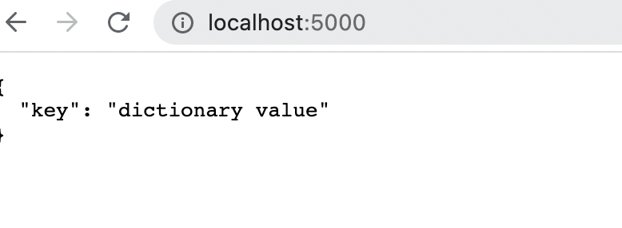
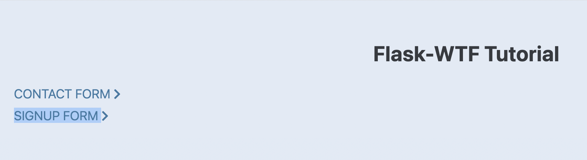
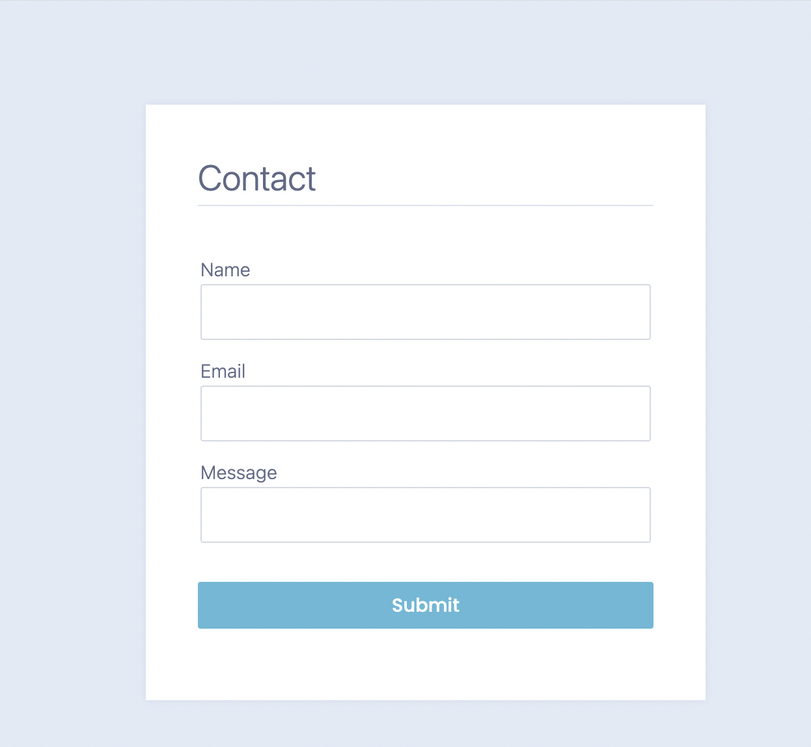
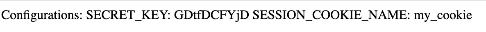

# IS 601 -Final Project

## Flask Application
    
[Creating Your First Flask Application](https://github.com/vnjit/Project)

[Rendering Pages in Flask Using Jinja](https://github.com/vnjit/Project/tree/part-2)

[Handling Forms in Flask with Flask-WTF](https://github.com/vnjit/Project/tree/Part-3)

[The Art of Routing in Flask](https://github.com/vnjit/Project/tree/Part-4)

[Configuring Your Flask App](https://github.com/vnjit/Project/tree/Part-5)

[Demystifying Flask’s Application Factory](https://github.com/vnjit/Project/tree/Part-6)

[Connect Flask to a Database with Flask-SQLAlchemy](https://github.com/vnjit/Project/tree/Part-9)

[Connect Flask to a Database with Flask-Login](https://github.com/vnjit/Project/tree/Part-10)

